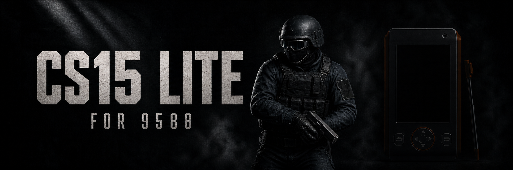
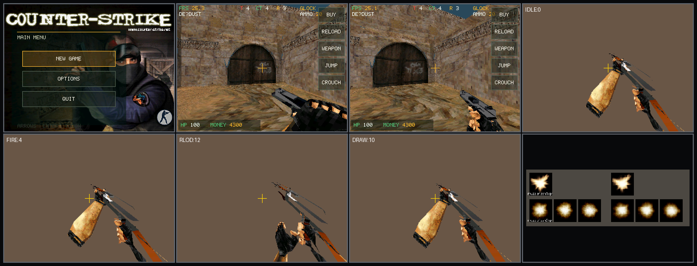

<p align="center">
  
</p>

<p align="center">
  <a href="https://github.com/HelloClyde/CS15-Lite-for9588/actions/workflows/release.yml"></a>
  <a href="https://github.com/HelloClyde/CS15-Lite-for9588/releases/latest"></a>
  
  <a href="LICENSE"></a>
</p>

`CS15 Lite` 是面向步步高 BBK 9588 学习机的小内存 Counter-Strike 1.5
风格单机移植。它不是在 9588 上运行完整 GoldSrc，而是把合法持有的历史地图、
StudioMDL、贴图、动画和音效离线转换成紧凑资源，再由一个专门的定点数软件 3D
运行时加载。

当前版本已经可以在真机上完成主菜单、地图与阵营选择、购买武器、移动瞄准、
射击换弹、Bot 对战和回合循环。画面为原生 `320×240` 横屏，实体方向键移动，
触摸拖动视角，实体确定键开火。

> [!IMPORTANT]
> 本仓库当前为私有仓库，私有 GitHub Release 提供与 BDA 配套的
> `CS15.C15PAK`，并保存用于 CI 预处理的原始 `cstrike` 素材归档。它们仅供
> 获得相关资源授权的仓库成员使用。不要公开、转发或随公开 fork 分发；如需
> 自行重建资源包，请参阅 [资源包指南](RESOURCE_PACK.md)。

## 游戏截图



<sub>经典主菜单与两张 de_dust 实战画面。</sub>

## 快速开始

### 1. 下载一键安装包

从 [Releases](https://github.com/HelloClyde/CS15-Lite-for9588/releases/latest)
下载 `CS15-Lite-for-9588-<版本>.zip`。解压后，将其中的 `应用` 文件夹复制到
9588 的 `A:\` 根目录并选择合并，即可同时安装程序和配套资源包。

ZIP 内已经排好真机目录：

```text
应用\程序\CS15Lite.bda
应用\数据\CS15LITE\CS15.C15PAK
```

### 2. 手动安装（可选）

也可以从同一个 Release 单独下载 `CS15Lite.bda`，复制到：

```text
A:\应用\程序\CS15Lite.bda
```

再下载配套的 `CS15.C15PAK`，复制到：

```text
A:\应用\数据\CS15LITE\CS15.C15PAK
```

也可以按照 [RESOURCE_PACK.md](RESOURCE_PACK.md)，使用自己合法持有的
CS 1.5 资源在本地重新生成。

程序与资源包有版本标记；若二者不匹配，启动地图时会显示
`RESOURCE PACK OUTDATED`，不会带着错误布局继续运行。

### 3. 启动

从学习机的游戏分类启动 `CS Lite`。首次建议进入 `Options`：

- `DIFFICULTY`：选择 `EASY / NORMAL / HARD`；
- `AUDIO`：打开或关闭真机 PCM 音效。

## 功能介绍

- **三张地图**：`de_dust`、`de_dust2`、`fy_iceworld`，带 BSP/PVS、纹理、
  hull 碰撞、重力、台阶和墙体滑动。
- **历史武器资源**：Knife、Glock 18、USP、AK-47、M4A1 的第一人称模型、
  贴图以及 Idle / Fire / Reload / Draw 动画。
- **枪口火焰**：将历史 `muzzleflash1.spr` / `muzzleflash2.spr` 离线压缩为
  23×23、4-bit 调色板的加色 Sprite，并绑定 StudioMDL 枪口 attachment。
- **队友和敌人**：共享低分辨率人物贴图、历史步行动画、离线 bone merge
  第三人称武器，固定池最多 7 个 Bot。
- **可调 AI**：难度实际改变反应时间、连发节奏、命中率、伤害和战斗走位，
  不是只有菜单文字变化。
- **完整游戏流程**：经典主菜单、地图选择、T/CT 选择、购买武器、回合胜负、
  金钱、生命、弹药和队伍存活数。
- **真机音频**：22050 Hz / signed 16-bit / mono PCM；玩家和 Bot 两路流式混音，
  支持历史枪声、刀声和换弹声，退出时恢复系统衰减值。
- **横屏输入**：实体方向键移动、实体确定键开火、触摸拖动视角，右侧半透明
  虚拟键负责购买、换弹、切枪、跳跃和下蹲。
- **直接帧缓冲**：查询固件 framebuffer 后使用 RGB565 连续写入，不走
  `bda_gui_render_picture()`，也不进行低分辨率放大。

## 控制

| 输入 | 功能 |
|---|---|
| 实体方向键 | 前进、后退、左右平移 |
| 实体确定键 | 开火 / 菜单确认 |
| 触摸拖动 | 跟手转动视角 |
| `BUY` | 打开购买菜单 |
| `RELOAD` | 换弹 |
| `WEAPON` | 切换已拥有武器 |
| `JUMP` / `CROUCH` | 跳跃 / 下蹲 |
| 长按退出键 | 返回系统菜单 |

## 小内存设计

9588 无法承受桌面 GoldSrc 的资源常驻方式，因此运行时使用固定 arena 和离线预处理：

| 区域 | 上限 / 当前峰值 |
|---|---:|
| 地图 arena | 744,704 B |
| 贴图 arena | 220,800 B |
| 模型 arena | 64 KiB；当前峰值 65,475 B |
| 资源/音频共享 scratch | 2 KiB |
| 完整静态镜像 | 1,572,624 / 1,572,864 B |

贴图在 PC 上预先选择 mip、量化为 RGB565/索引格式；玩家皮肤预滤波为 16×16；
动画只流入当前顶点帧；音频按 1024-byte 固件块读取，不常驻整段 PCM。

## 从源码构建

环境要求：Windows、PowerShell、Git、Python 3.10+ 和可用的 `gcc` 主机编译器。
SDK 以 `sdk/` submodule 引用：

```powershell
git clone --recurse-submodules https://github.com/HelloClyde/CS15-Lite-for9588.git
cd CS15-Lite-for9588

.\sdk\scripts\setup_toolchain.ps1
.\tools\test.ps1
.\tools\build.ps1 -Clean
```

输出：

```text
build\engine\CS Lite.bda
```

构建脚本固定使用 `-Os`、独立函数/数据 section 和 `--gc-sections`，并在链接后
强制检查 1.5 MiB 静态镜像上限。资源格式见 [docs/formats.md](docs/formats.md)。

## Tag Release

`.github/workflows/release.yml` 只在推送 `v*` tag 时运行：

```powershell
git tag v0.1.0
git push origin v0.1.0
```

工作流从固定的素材 Release 下载 `CS15-original-cstrike-assets.zip` 并验证
SHA-256。随后离线预处理地图、模型、贴图、动画和音频，运行 C/Python 测试，
构建 BDA，然后向 GitHub Release 上传：

- `CS15Lite.bda` 与 SHA-256；
- CI 重新生成的 `CS15.C15PAK` 与 SHA-256；
- `CS15-Lite-for-9588-<版本>.zip`：解压后可直接复制到 9588 的安装包；
- 资源转换器、格式文档和资源包指南组成的 resource-tools ZIP。

原始素材归档固定保存在 `v0.1.1` Release，新的 tag 不会重复上传这份
130 MB 归档。

## 目录

```text
sdk/                 BBK 9588 SDK submodule
src/app/             游戏流程、菜单、Bot 与回合逻辑
src/audio/           双通道流式 PCM
src/model/           紧凑 StudioMDL 与动画流
src/render/          RGB565 世界/模型软件光栅器
src/world/           BSP、碰撞和玩家移动
tools/assetc.py      合法本地资源离线转换器
tools/build-resource-pack.ps1
                      从 cstrike 生成并校验资源包
tools/build.ps1      BDA 交叉构建与静态内存门禁
tests/               主机 C 测试与资源格式测试
```

## 声明与许可证

本项目是非官方爱好者工程，与 Valve、Counter-Strike、步步高无隶属或背书关系。
Counter-Strike、Half-Life 及相关素材的权利归各自权利人所有；仓库中的游戏截图
仅用于说明兼容性和开发状态。

私有 Release 中的原始素材归档和转换资源包仅供已获得对应游戏资源授权的成员
使用，不得公开传播。若仓库重新转为公开，必须先移除这些 Release 资源。

源代码按 [GNU GPL v2 or later](LICENSE) 发布。`sdk` submodule 保留其自身许可证。
